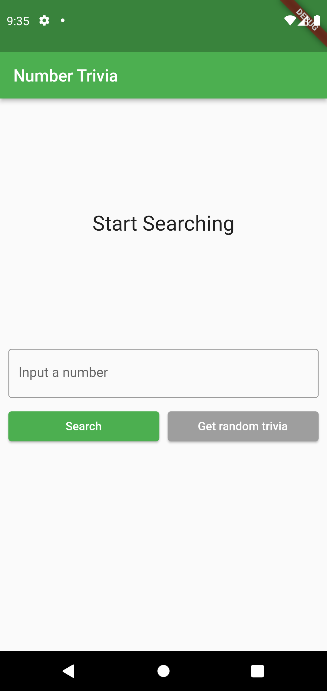
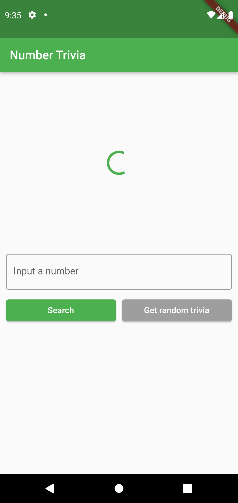
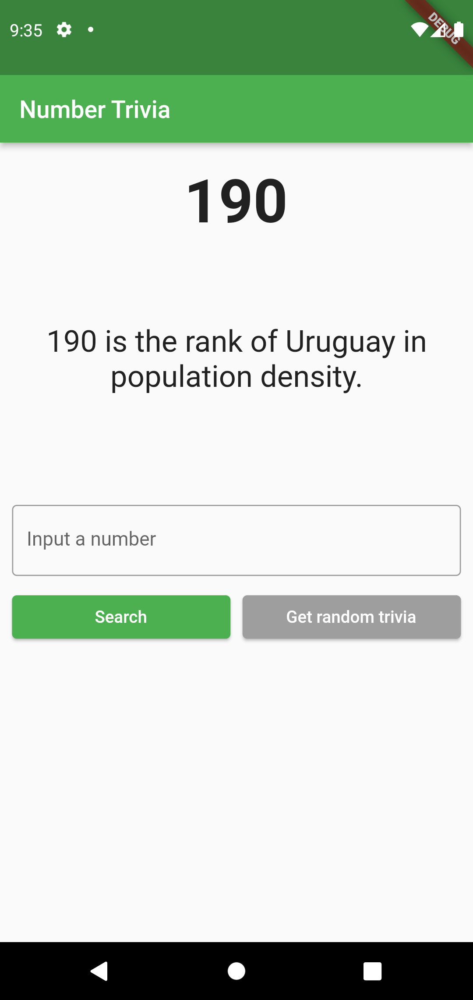

# Clean Architecture - TDD Reso Coder

This NumberTrivia App is an update of the youtube video series on [Flutter TDD Clean Architecture Course  ](https://bit.ly/3MXNpMy)


## Clean Architecture & Flutter

The Clean Architecture is the most powerful software design which promotes the separation of concerns and the creation of highly maintainable and flexible software systems, and this can be done by organizing the codebase into independent layers that communicate through defined interfaces.


## Pros of Clean Architecture

1.  **Separation of concerns**  
Clean Architecture promotes the separation of concerns, which helps to create a more organized and modular codebase. Each layer has a specific responsibility, and the layers are loosely coupled, which makes the code more maintainable and testable.

2. **Testability**  
It makes it easier to write automated tests, as the different layers are isolated and can be tested independently. This improves the quality of the software and reduces the risk of introducing bugs.

3. **Flexibility**  
Clean Architecture promotes a modular design that allows developers to swap out components or change the implementation details without affecting the rest of the system. This makes it easier to adapt to changing requirements or to introduce new features.

4. **Independence from external frameworks**     
It makes it possible to switch out external frameworks or libraries without affecting the rest of the system. This reduces the risk of being locked into a particular technology or vendor.

5. **Maintainability**   
It helps to create code that is easier to understand and maintain. By separating concerns and using clear interfaces between components, developers can work on different parts of the system without affecting other parts.


## Cons of Clean Architecture

1. **Overhead**    
It can add some overhead to the development process, as it requires more upfront planning and design. It may also require more code to be written, as each layer needs to have its own set of interfaces and abstractions.

2. **Complexity**   
It can make the codebase more complex, especially for smaller projects or simpler applications. It may be overkill for small, straightforward applications.


3. **Learning curve**           
It requires developers to understand the principles and concepts behind the architecture. This can be a challenge for developers who are new to the approach.


4. **Time-consuming**           
It can take more time to implement than other approaches, especially if the development team is not experienced with the approach.


## Explanation & Project organization
Every **feature** of the app, like getting some interesting trivia about a number, will be divided into 3 layers - __presentation__, __domain__ and __data__. The app we're building will have only one feature.


    .
    ├── lib                 
    │   ├── core        
    │   ├── features  
    |   │   ├── number_trivia       
    │   |   |   |-- data
    |   |   |   |-- domain
    |   |   |   |-- presentation
    ├── injection_container.dart
    ├── main.dart


## Screenshot

| Home | Loading | Trivia Number |
|  --- |  ---    |   ---    |
||||


## Installation

Download project
```bash
git clone https://github.com/salvadordeveloper/flutter-crypto-app
```

Get flutter dependencies
```bash
flutter pub get
```

Run the app
```bash
flutter run
```

If you have any error with generated files try to run this
```bash
flutter pub run build_runner build --delete-conflicting-outputs
```

## Testing
Unit Test
```bash
flutter test
```

## Tips
You should be aware that everything feels uncomfortable at first. Don't be discouraged if you don't grasp clean architecture right away. Keep going because the benefits are enormous, and you will notice improvements in your coding skills.